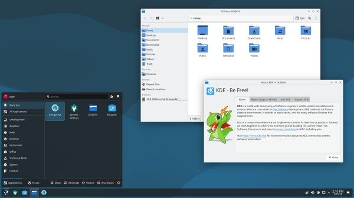
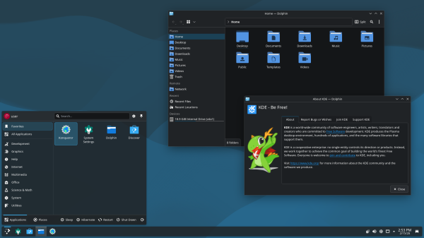

# debian13-papirus-look-and-feel

My personal Breeze setup for Debian 13 KDE, featuring **Papirus icons** and the **Ceratopsian wallpaper**.

I got tired of manually switching icons and wallpaper every time I applied a Breeze theme in System Settings, so I modified the default look-and-feel packages to do it automatically. Now when I select any of these themes, Papirus icons and the Ceratopsian wallpaper are applied instantly — no extra clicking required.

Everything else — window decorations, widgets, splash screen, cursors — is still pure Breeze.

---

## 📦 What's included

<!-- prettier-ignore-start -->
| | |
|:---:|:---:|
**Breeze** | **Breeze Dark** |
|  |  |
<!-- prettier-ignore-end -->

---

## ⚙️ What was changed

- **Icons**: Set to `Papirus` (instead of the default Breeze icons)
- **Wallpaper**: Set to `ceratopsian` (instead of the default)

All other settings remain untouched — window decorations, widget style, splash screen, cursors, etc., are still the original Breeze ones.

---

## 🔧 Installation

1. Make sure you have the required icon theme installed:

   ```bash
   sudo apt install papirus-icon-theme
   ```

2. Clone or download this repository

3. Copy the theme folders to your local Plasma directory:

   ```bash
   mkdir -p ~/.local/share/plasma/look-and-feel/
   cp -r org.kde.breeze* ~/.local/share/plasma/look-and-feel/
   ```

4. **Apply the theme:**
   - Open _System Settings_ → _Appearance_ → _Global Theme_
   - You should see "Breeze", "Breeze Dark", and "Breeze Twilight" in the list (the names haven't changed, but they now use Papirus icons and Ceratopsian wallpaper)
   - Select one and click _Apply_

---

## 📝 Notes

- These themes **override** the system ones because they're placed in `~/.local/share/plasma/look-and-feel/`, which has priority over `/usr/share/plasma/look-and-feel/`
- The `ceratopsian` wallpaper is included by default in Debian 13 KDE, so no extra package is needed for it
- Only tested on **Debian 13 (Trixie)** with **KDE Plasma**

---

## 📄 License

This repository contains modifications of the original KDE Breeze themes.
All content is distributed under the **GNU General Public License v2.0 or later** (GPL-2.0-or-later), the same as the original themes.

---

**Enjoy your Papirus + Ceratopsian Breeze desktop!**
